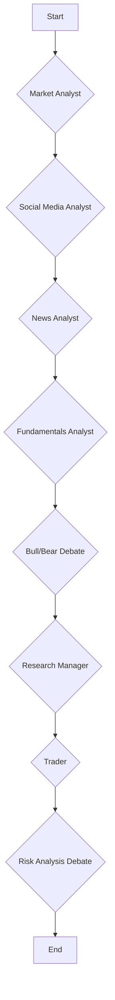

# Trading Agent Workflow Documentation

This document provides a detailed explanation of the trading agent's workflow, including the high-level architecture, the roles of individual agents, data flow, logging, and instructions for running and debugging the system.

## High-Level Agent Workflow

The trading agent is built on the LangGraph framework, which allows for the creation of cyclical, stateful agent graphs. The core of the application is the `TradingAgentsGraph`, which orchestrates the entire workflow. The agents operate on a shared `AgentState` object, which is passed from one agent to the next in a defined sequence. Each agent adds its findings to the state, enriching the context for subsequent agents.

### Orchestration Layer

- **`TradingAgentsGraph`**: This is the main class that initializes and runs the agent graph. It is responsible for:
  - Configuring the LLMs and other components.
  - Setting up the agent graph using `GraphSetup`.
  - Propagating the initial state through the graph.
  - Logging the final state of the graph.

- **`GraphSetup`**: This class is responsible for constructing the LangGraph workflow. It defines the nodes (agents) and edges (transitions) of the graph. The graph is a `StateGraph`, where each node modifies the shared `AgentState`.

- **`ConditionalLogic`**: This class defines the conditional logic for the edges in the graph. For example, it determines whether an analyst should call a tool or continue to the next agent, or whether the investment debate should continue or conclude.

### Workflow Visualization

The following Mermaid diagram illustrates the high-level workflow of the trading agent:



### Detailed Workflow Steps

1.  **Initiation**: The workflow begins when the `propagate` method of `TradingAgentsGraph` is called with a company ticker and a trade date. An `AgentState` object is created.

2.  **Analyst Sequence**: The `AgentState` is passed sequentially through a series of analyst agents. Each analyst adds its report to the state, which is then passed to the next analyst. By default, the sequence is:
    -   **Market Analyst**: Performs technical analysis of the stock.
    -   **Social Media Analyst**: Analyzes social media sentiment, using the market analyst's report for context.
    -   **News Analyst**: Gathers and analyzes news articles, using the reports from the previous analysts.
    -   **Fundamentals Analyst**: Analyzes the company's financial fundamentals, using all previous reports.

3.  **Investment Debate**: The reports from all analysts are then passed to a debate between a "Bull Researcher" and a "Bear Researcher". They argue for and against investing in the company.

4.  **Research Manager**: The "Research Manager" reviews the debate and makes a final investment recommendation (Buy, Sell, or Hold).

5.  **Trader**: The "Trader" takes the recommendation from the Research Manager and creates a detailed investment plan, including entry and exit points.

6.  **Risk Analysis Debate**: The investment plan is then passed to a risk analysis debate between three agents: "Risky Analyst", "Neutral Analyst", and "Safe Analyst". They debate the potential risks of the investment plan.

7.  **Risk Judge**: The "Risk Judge" reviews the risk analysis debate and makes a final decision on whether to execute the trade.

8.  **End**: The workflow ends with the final trade decision.

## Analyst Roles and Prompts

This section details the role of each analyst agent, the prompts they use, the tools they have access to, and a mocked example of their output.

### Market Analyst

The Market Analyst is the first agent in the sequence. Its primary role is to perform technical analysis of the stock's price data.

**Prompts:**

-   **Initial Prompt**:
    ```
    You are a market analyst. You have been provided with the following stock price data:

    {stock_data}

    Your task is to gather additional technical indicators and then write a comprehensive technical analysis report.

    You have already called the following indicators: {called_indicators}

    Available tools:
    - get_indicators: Get ONE indicator at a time (call separately for each: rsi, macd, close_50_sma, boll, atr)

    Steps:
    1. Analyze the provided stock price data.
    2. Call get_indicators for a new indicator that you have not called before.
    3. After gathering 3-5 indicators, write your technical analysis report.

    RULES:
    - Do NOT call the same indicator twice.
    - After 3-5 indicator calls, write your report.
    - Only cite exact values from tool responses.
    ```

-   **Final Report Prompt**:
    ```
    You are a market analyst. You have already collected stock data and technical indicators.
    Write a comprehensive technical analysis report NOW using the data from previous tool results.
    Include price trends, indicator analysis, and a final Market Outlook (Bullish/Bearish/Neutral).
    Do NOT call any more tools. Write the report directly.
    ```

**Tools:**

-   `get_indicators`: This tool is used to fetch technical indicators for the stock. The available indicators are RSI, MACD, 50-day SMA, Bollinger Bands, and ATR.

**Workflow:**

1.  The Market Analyst is initialized with the stock's price data.
2.  It iteratively calls the `get_indicators` tool to gather technical indicators.
3.  After 3-5 tool calls, it generates a comprehensive technical analysis report.
4.  The report is stored in the `market_report` field of the `AgentState`, and the entire updated state is passed to the next agent in the sequence.

**Mock Output:**

```
## Market Analyst Report

**Price Trends:**
The stock has been in a strong uptrend for the past 3 months, with a clear pattern of higher highs and higher lows. The price is currently trading above its 50-day simple moving average (SMA), which is a bullish sign.

**Indicator Analysis:**
- **RSI**: The Relative Strength Index (RSI) is currently at 65, indicating that the stock is approaching overbought territory but still has room to run.
- **MACD**: The Moving Average Convergence Divergence (MACD) line is above the signal line, which is a bullish crossover.
- **Bollinger Bands**: The price is trading within the upper Bollinger Band, which suggests strong momentum.

**Market Outlook:**
Based on the technical analysis, the market outlook for this stock is **Bullish**.
```

### Social Media Analyst

The Social Media Analyst analyzes public sentiment and key themes in social media discussions related to the company.

**Prompts:**

-   **Initial Prompt**:
    ```
    You are a social media analyst tasked with analyzing social media posts and public sentiment for a specific company over the past week.
    Your objective is to write a comprehensive report detailing your analysis of public sentiment, key themes in social media discussions, and the implications for traders and investors.
    Use the get_social_media_mentions(ticker, start_date, end_date) tool to search for social media discussions.
    Do not simply state the trends are mixed; provide detailed and fine-grained analysis and insights that may help traders make decisions.
     Make sure to append a Markdown table at the end of the report to organize key points in the report, organized and easy to read.
    ```

-   **Final Report Prompt**:
    ```
    You are a social media analyst. You have already gathered data for {ticker} as of {current_date}.
    Write a comprehensive report NOW using the data from previous tool results.
    Do NOT call any more tools. Write the report directly.

    Use these tool results as your primary evidence:
    {context_block}
    ```

**Tools:**

-   `get_social_media_mentions`: This tool is used to fetch social media mentions for the company.

**Workflow:**

1.  The Social Media Analyst receives the `AgentState`, which includes the report from the Market Analyst.
2.  It calls the `get_social_media_mentions` tool to gather social media posts.
3.  After one tool call, it generates a comprehensive report on public sentiment, key themes, and implications for traders.
4.  The report is stored in the `sentiment_report` field of the `AgentState`, and the entire updated state is passed to the next agent.

**Mock Output:**

```
## Social Media Analyst Report

**Public Sentiment:**
Public sentiment towards the company is largely positive, with a significant increase in bullish posts following the recent product announcement.

**Key Themes:**
- **Product Launch**: The new product has been met with widespread excitement, with many users praising its innovative features.
- **Competitive Advantage**: Several posts have highlighted the company's strong competitive advantage in the market.
- **Stock Price Target**: There is a growing consensus on social media that the stock is undervalued and has a high price target.

**Implications for Traders:**
The positive social media sentiment could lead to a short-term increase in the stock price. Traders should monitor the stock closely for a potential breakout.

| Key Point          | Sentiment | Implication                               |
| ------------------ | --------- | ----------------------------------------- |
| New Product Launch | Positive  | Potential for short-term price increase |
| Competitive Advantage | Positive  | Long-term bullish outlook                 |
| Stock Price Target | Positive  | Increased buying pressure                 |
```

### News Analyst

The News Analyst gathers and analyzes recent news articles and trends related to the company and the broader market.

**Prompts:**

-   **Initial Prompt**:
    ```
    You are a news researcher tasked with analyzing recent news and trends over the past week. Please write a comprehensive report of the current state of the world that is relevant for trading and macroeconomics. Use the available tools: get_company_info(ticker) to get fundamental context like fiscal year end, earnings dates, current price, and 52-week high/low; get_news(query, start_date, end_date) for company-specific or targeted news searches, and get_global_news(curr_date, look_back_days, limit) for broader macroeconomic news. Do not simply state the trends are mixed; provide detailed and finegrained analysis and insights that may help traders make decisions.
     Make sure to append a Markdown table at the end of the report to organize key points in the report, organized and easy to read.

    CRITICAL RULE: You MUST ONLY cite specific facts, events, dates, and data points that are EXPLICITLY STATED in the news articles you fetch. DO NOT make up, estimate, assume, or infer information that is not directly mentioned in the retrieved news. If you don't have specific information from news articles (e.g., exact earnings dates, specific performance metrics), do not make claims about it - instead describe what the news articles actually discuss.

    TIMELINE SYNTHESIS: When analyzing news, pay attention to timing and tense:
    - If news articles mention "earnings beat" or "Q1 results released" or "reported revenue of X", earnings ALREADY HAPPENED (use past tense)
    - If articles say "expected to report" or "analysts anticipate" or "upcoming earnings", earnings HAVE NOT HAPPENED YET (use future tense)
    - Cross-reference with get_company_info to verify earnings dates if available
    - Compare article publication dates with the current date ({current_date}) and earnings dates to determine correct timing
    - Be precise: don't say "expected to release" when articles clearly discuss already-released results

    IMPORTANT: When discussing company earnings and fiscal calendars:
    - Many companies use fiscal years that differ from a calendar year.
    - For example, Microsoft's fiscal year ends in June, so:
      * FY26 Q1 = July-September 2025 (calendar Q3 2025)
      * FY26 Q2 = October-December 2025 (calendar Q4 2025)
    - Always check the company's fiscal calendar before making assumptions about earnings timing.
    - Be explicit about whether you're referring to fiscal quarters or calendar quarters.
    - When you see earnings scheduled for a specific date, determine which fiscal quarter it represents based on the company's fiscal year.
    ```

-   **Final Report Prompt**:
    ```
    You are a news analyst. You have already gathered data.
    Write a comprehensive report NOW using the data from previous tool results.
    Do NOT call any more tools. Write the report directly.
    ```

**Tools:**

-   `get_company_info`: Fetches fundamental company information, such as fiscal year end, earnings dates, and price data.
-   `get_news`: Searches for company-specific news articles.
-   `get_global_news`: Fetches broader macroeconomic news.

**Workflow:**

1.  The News Analyst receives the `AgentState`, which includes reports from the previous analysts.
2.  It iteratively calls the `get_company_info`, `get_news`, and `get_global_news` tools to gather information.
3.  After 3 tool calls, it generates a comprehensive report on the current state of the world, relevant news, and the company's situation.
4.  The report is stored in the `news_report` field of the `AgentState`, and the entire updated state is passed to the next agent.

**Mock Output:**

```
## News Analyst Report

**Company-Specific News:**
The company recently announced a partnership with a major tech firm, which has been well-received by the market. The partnership is expected to drive significant revenue growth in the coming year.

**Macroeconomic News:**
Recent inflation data has come in lower than expected, which could lead the central bank to pause its interest rate hikes. This would be a positive development for the stock market.

**Timeline Synthesis:**
The company is expected to report its Q3 earnings on November 15th. Analysts are anticipating strong results, driven by the new partnership.

| Key Point                 | Type             | Implication                        |
| ------------------------- | ---------------- | ---------------------------------- |
| Partnership with tech firm | Company-Specific | Positive for revenue growth        |
| Lower inflation data      | Macroeconomic    | Positive for the stock market      |
| Upcoming earnings report  | Company-Specific | Potential for positive surprise    |
```

### Fundamentals Analyst

The Fundamentals Analyst analyzes the company's financial health, growth trends, and key metrics.

**Prompts:**

-   **Initial Prompt**:
    ```
    You are a fundamental analyst. Call the available tools to gather data, then write a comprehensive analytical report.
    DO NOT explain what you're about to do or narrate your process - just use the tools and report your analysis.

    You have already called the following tools: {called_tools}

    Available tools: get_company_info, get_fundamentals, get_balance_sheet, get_cashflow, get_income_statement.
    Call get_company_info first for context (fiscal year, earnings dates, price ranges), then use other tools to gather comprehensive financial data.
    When calling financial statements, prefer `freq="annual"` and focus on the last 5 fiscal years unless the query requires quarterly granularity.
    If a tool returns a long JSON payload, summarize the key figures (revenue, margins, cash flow, debt) and keep the analysis concise.

    After gathering data via tools, write your report with:
    - Company profile and recent performance
    - Financial health analysis (balance sheet strength, cash flow, profitability)
    - Growth trends and year-over-year comparisons
    - Key metrics and ratios with actual values
    - Detailed, specific insights (not generic statements like 'trends are mixed')
    - A summary table at the end organizing key metrics

    CRITICAL RULE: You MUST ONLY cite specific numbers, metrics, and data points that are EXPLICITLY STATED in the data returned by the tools. DO NOT make up, estimate, round, or infer numerical values. Report exact values from tool responses.
    ```

-   **Final Report Prompt**:
    ```
    You are a fundamental analyst. You have already gathered data for {ticker} as of {current_date}.
    Write a comprehensive analytical report NOW using the data from previous tool results.
    Do NOT call any more tools. Write the report directly.

    Use these tool results as your primary evidence:
    {context_block}
    ```

**Tools:**

-   `get_company_info`: Fetches fundamental company information.
-   `get_fundamentals`: Fetches key financial ratios and metrics.
-   `get_balance_sheet`: Fetches the company's balance sheet.
-   `get_cashflow`: Fetches the company's cash flow statement.
-   `get_income_statement`: Fetches the company's income statement.

**Workflow:**

1.  The Fundamentals Analyst receives the `AgentState`, which includes reports from all previous analysts.
2.  It iteratively calls the available tools to gather financial data.
3.  After 4 tool calls, it generates a comprehensive report on the company's financial performance, health, and growth trends.
4.  The report is stored in the `fundamentals_report` field of the `AgentState`, and the entire updated state is passed to the debate stage.

**Mock Output:**

```
## Fundamentals Analyst Report

**Company Profile:**
The company is a leading provider of software solutions for the healthcare industry. It has a strong track record of innovation and a loyal customer base.

**Financial Health:**
The company has a strong balance sheet with a low debt-to-equity ratio. It has a consistent track record of generating positive cash flow from operations.

**Growth Trends:**
Revenue has grown at a compound annual growth rate (CAGR) of 15% over the past 5 years. Net income has grown at a CAGR of 20% over the same period.

**Key Metrics:**
- **P/E Ratio**: 25.0
- **P/B Ratio**: 4.0
- **Dividend Yield**: 2.0%
- **ROE**: 16.0%
- **ROA**: 8.0%

| Metric         | Value |
| -------------- | ----- |
| P/E Ratio      | 25.0  |
| P/B Ratio      | 4.0   |
| Dividend Yield | 2.0%  |
| ROE            | 16.0% |
| ROA            | 8.0%  |
```

## Debate, Trader, and Risk Management Stages

After the analysts have gathered and presented their reports, the workflow moves into a series of debates and decision-making stages. The full `AgentState`, containing all analyst reports, is available to all participants in these stages.

### Investment Debate

The investment debate is a multi-turn conversation between a Bull Researcher and a Bear Researcher. They take turns arguing their case, using the information from the analyst reports to support their arguments.

-   **Bull Researcher**: The Bull Researcher advocates for investing in the stock, focusing on growth potential, competitive advantages, and positive market indicators.
-   **Bear Researcher**: The Bear Researcher argues against investing, emphasizing risks, challenges, and negative indicators.

The debate continues for a configurable number of rounds, with each researcher responding to the other's arguments.

### Research Manager

The Research Manager acts as a judge for the investment debate. After the debate has concluded, the Research Manager reviews the arguments from both sides and makes a final investment recommendation (Buy, Sell, or Hold). The Research Manager also creates a detailed investment plan for the trader.

### Trader

The Trader takes the investment plan from the Research Manager and refines it into a specific, actionable trading plan. The Trader's final output is a `FINAL TRANSACTION PROPOSAL: **BUY/HOLD/SELL**`.

### Risk Analysis Debate

The Trader's investment plan is then passed to a risk analysis debate between three agents:

-   **Risky Analyst**: The Risky Analyst champions high-reward, high-risk opportunities, emphasizing bold strategies and competitive advantages.
-   **Conservative Analyst**: The Conservative Analyst prioritizes stability, security, and risk mitigation, carefully assessing potential losses and market volatility.
-   **Neutral Analyst**: The Neutral Analyst provides a balanced perspective, weighing both the potential benefits and risks of the investment plan.

The risk analysis debate is a multi-turn conversation, with each analyst arguing their perspective and responding to the others.

### Risk Judge

The Risk Judge acts as the final decision-maker in the workflow. The Risk Judge reviews the risk analysis debate and makes a final, binding decision on whether to execute the trade. The final decision is one of **BUY**, **SELL**, or **HOLD**.

## API Calls and Data Flow

The trading agent uses a variety of external APIs to gather data for its analysis. The `route_to_vendor` function in `tradingagents/dataflows/interface.py` determines which API to use based on the configuration in `default_config.py`.

### API Call Details

#### Alpha Vantage

All Alpha Vantage API calls are made to the `https://www.alphavantage.co/query` endpoint with a `function` parameter that specifies the desired data. The following functions are used:

-   **Stock Prices**: `TIME_SERIES_DAILY_ADJUSTED`
-   **Technical Indicators**: `SMA`, `EMA`, `MACD`, `RSI`, `BBANDS`, `ATR`
-   **Fundamental Data**: `OVERVIEW`, `BALANCE_SHEET`, `CASH_FLOW`, `INCOME_STATEMENT`
-   **News & Sentiment**: `NEWS_SENTIMENT`
-   **Insider Transactions**: `INSIDER_TRANSACTIONS`

#### yfinance Library

The `yfinance` library is used to fetch data from Yahoo Finance. The following functions and attributes are used on a `yf.Ticker` object:

-   **Stock Prices**: `history()`
-   **Financial Statements**: `balance_sheet`, `quarterly_balance_sheet`, `cashflow`, `quarterly_cashflow`, `income_stmt`, `quarterly_income_stmt`
-   **Insider Transactions**: `insider_transactions`
-   **Company Information**: `info`, `calendar`

### Data Flow

1.  **Tool Call**: An analyst agent calls a tool function (e.g., `get_indicators`).
2.  **Routing**: The `route_to_vendor` function determines the appropriate data provider (e.g., `alpha_vantage`).
3.  **API Call**: The corresponding function in the vendor-specific module makes the external API call using one of the endpoints or library functions listed above.
4.  **Response**: The API response is returned to the analyst agent.
5.  **State Update**: The analyst agent processes the data and updates the `AgentState` with its report.
6.  **Next Agent**: The updated `AgentState` is passed to the next agent in the workflow, allowing for a cumulative build-up of information.

## Logging and Debugging

The application provides detailed logging and debugging capabilities to help you understand the agent's workflow and troubleshoot any issues.

### Logging

The `TradingAgentsGraph` class includes a `_log_state` method that logs the final state of the graph to a JSON file. This log file contains a wealth of information about the agent's execution, including:

-   The company of interest and the trade date.
-   The reports generated by each analyst.
-   The complete history of the investment and risk analysis debates.
-   The final trade decision.

The log files are saved in the `eval_results/{ticker}/TradingAgentsStrategy_logs/` directory, with a separate file for each trade date.

### Debugging

To enable debugging, set the `debug` parameter to `True` when creating the `TradingAgentsGraph` instance:

```python
ta = TradingAgentsGraph(debug=True)
```

In debug mode, the application will stream the execution of the graph to the console, printing the output of each node as it is executed. This allows you to follow the agent's workflow in real-time and inspect the state at each step.

## Running on LangGraph Studio

LangGraph Studio provides a powerful web-based interface for visualizing, debugging, and deploying your LangGraph applications.

### Setup

1.  **Install the LangGraph Studio client**:
    ```bash
    pip install langgraph-studio
    ```

2.  **Create a LangGraph Studio account**:
    -   Go to the [LangGraph Studio website](https://langgraph.studio/) and create an account.
    -   Create a new graph and obtain an API key.

3.  **Set the environment variable**:
    -   Set the `LANGGRAPH_STUDIO_API_KEY` environment variable to your API key.
        ```bash
        export LANGGRAPH_STUDIO_API_KEY="your-api-key"
        ```

### Code Modifications

To connect your application to LangGraph Studio, you need to make a small modification to the `TradingAgentsGraph` class.

1.  **Import the `watch_graph` function**:
    -   In `tradingagents/graph/trading_graph.py`, add the following import statement:
        ```python
        from langgraph_studio import watch_graph
        ```

2.  **Register the graph**:
    -   In the `__init__` method of the `TradingAgentsGraph` class, after the graph is compiled, call the `watch_graph` function:
        ```python
        self.graph = self.graph_setup.setup_graph(selected_analysts)
        watch_graph(self.graph, "Trading Agents Graph")
        ```

### Running and Debugging

1.  **Run the application**:
    -   Run your application as you normally would. The graph will be automatically sent to LangGraph Studio.

2.  **Open LangGraph Studio**:
    -   Open the LangGraph Studio web interface and select your graph.

3.  **Visualize and Debug**:
    -   You will see a visual representation of your graph, with each node and edge clearly displayed.
    -   You can click on each node to inspect the input and output of that step.
    -   You can view the full state of the graph at each step, making it easy to trace the flow of data and debug any issues.
