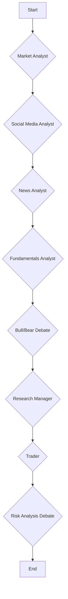

# Trading Agent Workflow Documentation

This document provides a detailed explanation of the trading agent's workflow, including the high-level architecture, the roles of individual agents, data flow, logging, and instructions for running and debugging the system.

## High-Level Agent Workflow

The trading agent is built on the LangGraph framework, which allows for the creation of cyclical, stateful agent graphs. The core of the application is the `TradingAgentsGraph`, which orchestrates the entire workflow. The agents operate on a shared `AgentState` object, which is passed from one agent to the next in a defined sequence. Each agent adds its findings to the state, enriching the context for subsequent agents.

### Orchestration Layer

- **`TradingAgentsGraph`**: This is the main class that initializes and runs the agent graph. It is responsible for:
  - Configuring the LLMs and other components.
  - Setting up the agent graph using `GraphSetup`.
  - Propagating the initial state through the graph.
  - Logging the final state of the graph.

- **`GraphSetup`**: This class is responsible for constructing the LangGraph workflow. It defines the nodes (agents) and edges (transitions) of the graph. The graph is a `StateGraph`, where each node modifies the shared `AgentState`.

- **`ConditionalLogic`**: This class defines the conditional logic for the edges in the graph. For example, it determines whether an analyst should call a tool or continue to the next agent, or whether the investment debate should continue or conclude.

### Workflow Visualization

The following Mermaid diagram illustrates the high-level workflow of the trading agent:

### Detailed Workflow Steps

1. **Initiation**: The workflow begins when the `propagate` method of `TradingAgentsGraph` is called with a company ticker and a trade date. An `AgentState` object is created.

2. **Analyst Sequence**: The `AgentState` is passed sequentially through a series of analyst agents. Each analyst adds its report to the state, which is then passed to the next analyst. By default, the sequence is:
   - **Market Analyst**: Performs technical analysis of the stock.
   - **Social Media Analyst**: Analyzes social media sentiment, using the market analyst's report for context.
   - **News Analyst**: Gathers and analyzes news articles, using the reports from the previous analysts.
   - **Fundamentals Analyst**: Analyzes the company's financial fundamentals, using all previous reports.

3. **Investment Debate**: The reports from all analysts are then passed to a debate between a "Bull Researcher" and a "Bear Researcher". They argue for and against investing in the company.

4. **Research Manager**: The "Research Manager" reviews the debate and makes a final investment recommendation (Buy, Sell, or Hold).

5. **Trader**: The "Trader" takes the recommendation from the Research Manager and creates a detailed investment plan, including entry and exit points.

6. **Risk Analysis Debate**: The investment plan is then passed to a risk analysis debate between three agents: "Risky Analyst", "Neutral Analyst", and "Safe Analyst". They debate the potential risks of the investment plan.

7. **Risk Judge**: The "Risk Judge" reviews the risk analysis debate and makes a final decision on whether to execute the trade.

8. **End**: The workflow ends with the final trade decision.

## Analyst Roles and Prompts

This section details the role of each analyst agent, the prompts they use, the tools they have access to, and a mocked example of their output.

### Market Analyst

The Market Analyst is the first agent in the sequence. Its primary role is to perform technical analysis of the stock's price data.

**Prompts:**
...
**Workflow:**

1. The Market Analyst is initialized with the stock's price data.
2. It iteratively calls the `get_indicators` tool to gather technical indicators.
3. After 3-5 tool calls, it generates a comprehensive technical analysis report.
4. The report is stored in the `market_report` field of the `AgentState`, and the entire updated state is passed to the next agent in the sequence.

**Mock Output:**
...

### Social Media Analyst

The Social Media Analyst analyzes public sentiment and key themes in social media discussions related to the company.

**Prompts:**
...
**Workflow:**

1. The Social Media Analyst receives the `AgentState`, which includes the report from the Market Analyst.
2. It calls the `get_social_media_mentions` tool to gather social media posts.
3. After one tool call, it generates a comprehensive report on public sentiment, key themes, and implications for traders.
4. The report is stored in the `sentiment_report` field of the `AgentState`, and the entire updated state is passed to the next agent.

**Mock Output:**
...

### News Analyst

The News Analyst gathers and analyzes recent news articles and trends related to the company and the broader market.

**Prompts:**
...
**Workflow:**

1. The News Analyst receives the `AgentState`, which includes reports from the previous analysts.
2. It iteratively calls the `get_company_info`, `get_news`, and `get_global_news` tools to gather information.
3. After 3 tool calls, it generates a comprehensive report on the current state of the world, relevant news, and the company's situation.
4. The report is stored in the `news_report` field of the `AgentState`, and the entire updated state is passed to the next agent.

**Mock Output:**
...

### Fundamentals Analyst

The Fundamentals Analyst analyzes the company's financial health, growth trends, and key metrics.

**Prompts:**
...
**Workflow:**

1. The Fundamentals Analyst receives the `AgentState`, which includes reports from all previous analysts.
2. It iteratively calls the available tools to gather financial data.
3. After 4 tool calls, it generates a comprehensive report on the company's financial performance, health, and growth trends.
4. The report is stored in the `fundamentals_report` field of the `AgentState`, and the entire updated state is passed to the debate stage.

**Mock Output:**
...
## Debate, Trader, and Risk Management Stages

After the analysts have gathered and presented their reports, the workflow moves into a series of debates and decision-making stages. The full `AgentState`, containing all analyst reports, is available to all participants in these stages.

### Investment Debate
...
## API Calls and Data Flow
...
### Data Flow

1. **Tool Call**: An analyst agent calls a tool function (e.g., `get_indicators`).
2. **Routing**: The `route_to_vendor` function determines the appropriate data provider (e.g., `alpha_vantage`).
3. **API Call**: The corresponding function in the vendor-specific module (e.g., `tradingagents/dataflows/alpha_vantage.py`) makes the external API call.
4. **Response**: The API response is returned to the analyst agent.
5. **State Update**: The analyst agent processes the data and updates the `AgentState` with its report.
6. **Next Agent**: The updated `AgentState` is passed to the next agent in the workflow, allowing for a cumulative build-up of information.

## Logging and Debugging
...
## Running on LangGraph Studio
...
